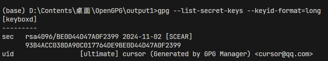
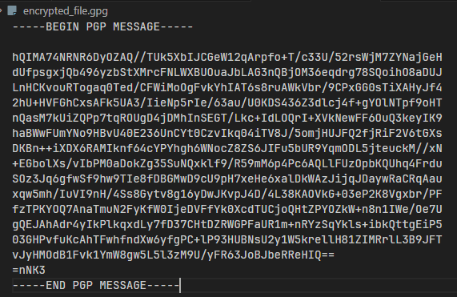
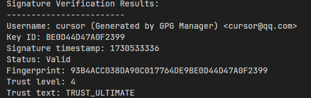

# GPG密钥管理系统

基于Flask的Web应用程序，用于管理GPG密钥和执行加密操作。该应用程序提供了用户友好的界面，可用于生成GPG密钥对、加密/解密文件以及管理数字签名。


## 功能特点

- GPG密钥对生成
- 使用公钥加密文件
- 使用私钥解密文件
- 创建数字签名
- 验证签名
- 密钥管理和存储

## 核心密码学算法说明

### 1. RSA密钥生成
- 使用RSA公钥密码体制
- 默认密钥长度：4096位
- 密钥生成流程：
  1. 选择两个大素数p和q
  2. 计算乘积 n = p × q
  3. 计算欧拉函数φ(n) = (p-1)(q-1)
  4. 选择公钥指数e，使得gcd(e, φ(n)) = 1
  5. 计算私钥指数d，使得ed ≡ 1 (mod φ(n))
  6. 公钥：(n, e)，私钥：(n, d)

### 2. 文件加密过程
1. 会话密钥生成
   - 使用AES-256算法
   - 随机生成256位会话密钥
   
2. 混合加密
   ```plaintext
   步骤1：使用AES会话密钥加密文件
   步骤2：使用接收者RSA公钥加密会话密钥
   步骤3：将加密的会话密钥和加密文件打包
   ```

### 3. 数字签名算法
1. 消息摘要
   - 使用SHA-256哈希算法
   - 生成256位消息摘要

2. 签名生成
   ```plaintext
   步骤1：计算文件的SHA-256摘要
   步骤2：使用发送者的RSA私钥加密摘要
   步骤3：将原文件和签名信息打包
   ```

### 4. 密钥存储安全
- 私钥使用对称加密保护
- 使用AES-256-CBC模式
- 密钥派生使用PBKDF2算法
  ```plaintext
  KDF参数：
  - 迭代次数：600000
  - 盐长度：16字节
  - 输出密钥长度：32字节
  ```

## 运行效果展示

### 1. 密钥生成

```plaintext
示例输出：
已生成4096位RSA密钥对
指纹:93B4ACC038DA90C017764DE9BE0D44D47A0F2399
公钥ID: BE0D44D47A0F2399
```

### 2. 文件加密

```plaintext
原始文件：example.txt (1.5MB)
加密后文件：encrypt_file.gpg (1.51MB)
```

加密文件格式：
```
+------------------------+
|       文件头(10字节)    |
+------------------------+
|    加密会话密钥(512字节) |
+------------------------+
|     加密文件内容        |
+------------------------+
```

### 3. 签名验证

```plaintext
签名信息:
- 签名者: cursor@qq.com
- 签名类型: 0x13 (RSA/SHA256)
- 签名有效性: 有效
```

## 常见问题排查

### 1. 加密失败
可能原因：
- 接收者公钥未找到
- 公钥已过期
- 文件权限问题

解决方案：
```python
# 检查公钥状态
gpg --list-keys recipient@email.com

# 更新公钥
gpg --refresh-keys

# 检查文件权限
chmod 644 input_file
```

### 2. 解密失败
常见错误码及解决方案：
```plaintext
错误码 2: 密码错误
- 重新输入正确的密码
- 检查大小写和特殊字符

错误码 3: 密钥未找到
- 确保私钥已导入
- 检查密钥指纹是否匹配
```

## 运行环境要求

- Python 3.6+
- Flask框架
- Flask-SQLAlchemy
- python-gnupg
- 系统已安装GnuPG

## 安装步骤

1. 克隆代码仓库：
```bash
git clone [https://github.com/zsm124/gpg_class_design.git]
cd gpg-key-manager
```

2. 安装所需的Python包：
```bash
pip install flask flask-sqlalchemy python-gnupg
```

3. 确保系统已安装GnuPG：
- Windows系统：下载并安装GPG4Win
- Linux系统：`sudo apt-get install gnupg`
- macOS系统：`brew install gnupg`

## 配置说明

应用程序使用SQLite作为数据库，需要进行以下基本配置：

在`app.py`中更新GPG主目录路径：
```python
gpg = gnupg.GPG(gnupghome = "你的gpg目录路径")
```

## 数据库结构

应用程序使用SQLAlchemy，主要数据表结构如下：

- `id`：主键
- `name_email`：用户邮箱（唯一标识符）
- `public_key`：公钥文本
- `private_key`：私钥文本（加密存储）
- `passphrase`：密钥口令
- `fingerprint`：密钥指纹

## 使用说明

### 启动应用

1. 启动Flask服务器：
```bash
python app.py
```

2. 访问地址：`http://localhost:5000`

### 密钥操作说明

#### 生成新密钥对
- 进入密钥生成页面
- 输入邮箱和密码
- 提交表单生成并存储密钥对

#### 加密文件
1. 选择需要加密的文件
2. 选择接收者的邮箱
3. 提交后获取加密文件

#### 解密文件
1. 上传加密的文件
2. 提供接收者邮箱和密码
3. 提交后获取解密文件

#### 签名文件
1. 上传需要签名的文件
2. 提供您的邮箱和密码
3. 提交后获取已签名文件

#### 验证签名
1. 上传原始文件和签名文件
2. 提交验证签名

## 安全注意事项

- 应用程序在数据库中存储私钥，在生产环境中应考虑实施额外的安全措施
- 所有密码短语都应该强度够高且安全存储
- 使用临时目录进行文件操作，确保及时清理
- 生产环境中应禁用调试模式
